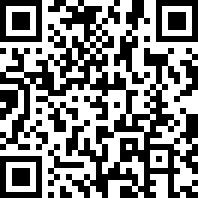

# Bootstrap layout landing 
> [PSD template] -> [Bootstrap layout landing] practice
> 
<a href="https://username1111111111.github.io/Bootstrap-layout-landing/">Live demo here</a>

> 
Or 👇:

## Table of Contents
* [General Info](#general-information)
* [Highlights](#highlights)
* [Screenshots](#screenshots)
* [Usage](#usage)
* [Contact](#contact)

## General Information
- This was done as an independent practice to turn any PSD template into landing using Bootstrap and some other things

## Highlights
- Bootstrap
- Animate.js
- Fontawesome icons

## Screenshots

## Usage
Just clone the repo and open **index.html** in a browser 👍

## Contact

<a style="text-decoration: none;"href="https://github.com/Username1111111111/Username1111111111">@Username1111111111</a>
 
  
The Frontend developer 

   💪

